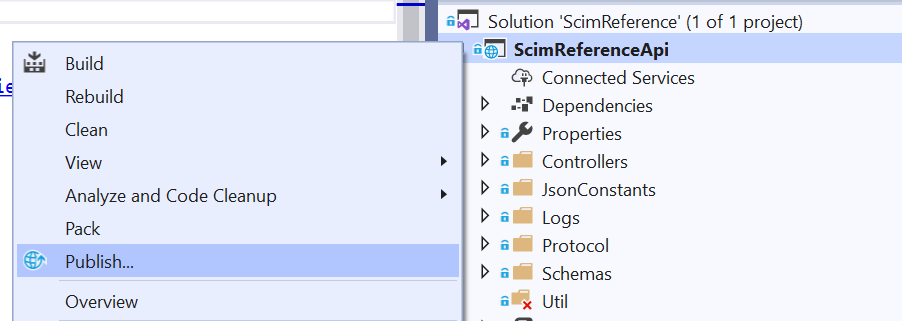

# Getting started with the solution
## Prerequisites

1. [Visual Studio 2019](https://visualstudio.microsoft.com/downloads/) (required)
2. [.NET core 3.1 or above](https://dotnet.microsoft.com/download/dotnet-core/3.1) (required)
3. [IIS](https://www.microsoft.com/download/details.aspx?id=48264) (required)
4. [Postman](https://www.getpostman.com/downloads/) (optional)

## Clone the repo and build your SCIM endpoint

The solution is located in the ScimReferenceApi folder and can be built and run from VisualStudio locally or hosted in the cloud.

#### Steps to run the solution locally
1. Click **"Clone or download"** and click **"Open in Desktop"** OR copy the link.
 
2. If you chose to copy the link, open Visual Studio and choose **"Clone or check out code**. 

3. Use the copied link from Github to make a local copy of all files.

4. The Solution Explorer should open. Navigate to **Microsoft.SCIM.sln** view by double-clicking on it.

5. Click **IIS Express** to execute. The project will launch as a web page with the local host URL.

#### Steps to host the solution in the Azure
1. Open Visual Studio and sign into the account that has access to your hosting resources. 
2. While in the **SCIMReference.sln** view, right-click the **SCIMReferenceApi** file in the Solution Explorer and select **"Publish"**.

    

3. Click create profile. Make sure **App Service** and **"Create new"** is selected. 

    
    
4. Walk through the options in the dialog. 
5. Rename the app to a desired name of your choice. The name is used for both the app name and the SCIM Endpoint URL.

    

6. Select the resource group and plan you would like to use and click **"Publish"**.

All the endpoints are are at the **{host}/scim/** directory and can be interacted with standard HTTP requests. The **/scim/** route can be modified in the **ControllerConstant.cs** file located in **AzureADProvisioningSCIMreference > ScimReferenceApi > Controllers**.

## Test your SCIM endpoint
Provided below are test cases that you can use to ensure that your SCIM endpoint is compliant with the SCIM RFC. 

#### Postman instructions
1. Download the [Postman client](https://www.getpostman.com/downloads/).
2. Import the Postman collection by copying the link [here](https://aka.ms/ProvisioningPostman) and pasting it into Postman as shown below:

    

3. Create a Postman environment for testing by specifying the following variables below:
    * **If running the project locally**:

        |Variable|Value|
        |---|---|
        |Server|localhost|
        |Port|*The port you are using (e.g. **:44355**)|
        |API|scim|
            
    * **If hosting the endpoint in Azure**:
        
        |Variable|Value|
        |---|---|
        |Server|scimreferenceapi19.azurewebsites.net|
        |Port||
        |API|scim|

4. Turn off SSL Cert verification by navigating to  **File > Settings > General > SSL certificate verification**.

    

5. Ensure that you are authorized to make requests to the endpoint:
    * **Option 1**: Turn off authorization for your endpoint (this is fine for testing purposes, but there must be some form of authorization for apps being used by customers in production).
    * **Option 2**: POST to key endpoint to retrieve a token.

6. Run your tests!

#### Tests executed

|Test|Description|
|---|---|
|CRUD operations on a Resource|Test that resources can be made, modified and deleted.|
|Resource filtering|Test that specific resources are located and returned by filtered value (e.g. **?filters=DisplayName+eq+%22BobIsAmazing%22**).|
|Attribute filtering|Test that specific attributes are located and returned (e.g. **?attributes=userName,emails**).|
